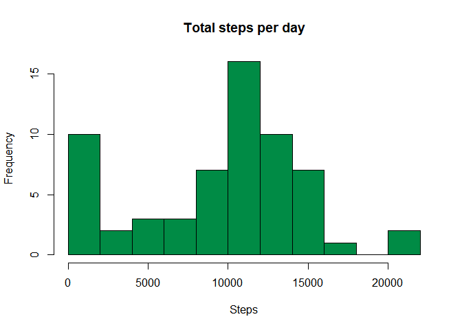
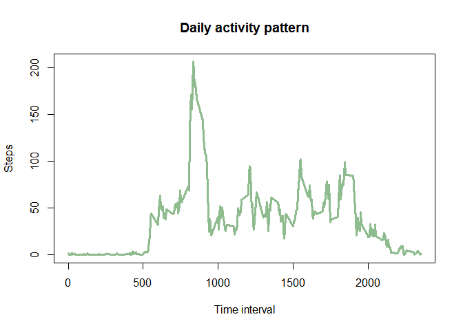
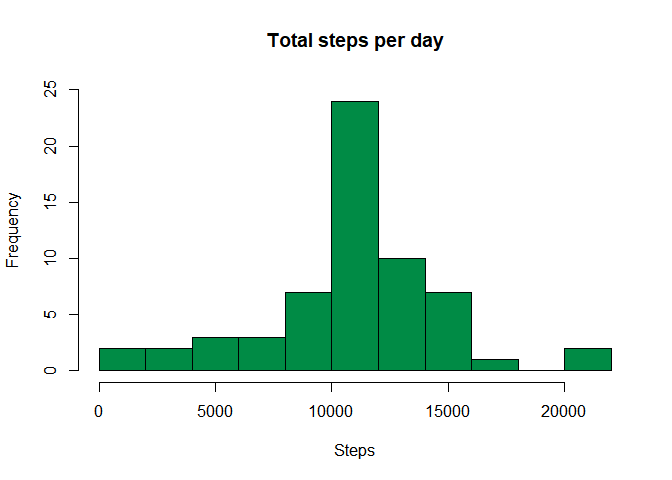
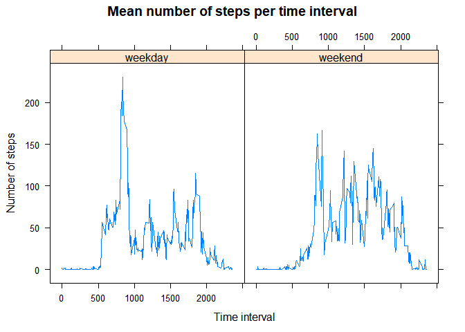

## Introduction

In this report we are going to show some results extracted from the measurements of the personal activity monitoring device from an anonymous individual. This device collects data at 5 minute intervals through out the day and we will use data collected during the months of October and November, 2012 and include the number of steps taken in 5 minute intervals each day.

The variables included in this dataset are:

- **steps**: Number of steps taken in a 5-minute intervale (missing values are coded as NA)
- **date**: The date on which the measurement was taken in YYYY-MM-DD format
- **interval**: Identifier for the 5-minute interval in which measurement was taken

## Loading and preprocessing the data

Some sample data is shown below:


```r
activity <- read.csv("activity.csv")
activity$date <- as.Date(activity$date, format = "%Y-%m-%d")
head(activity)
```

```
##   steps       date interval
## 1    NA 2012-10-01        0
## 2    NA 2012-10-01        5
## 3    NA 2012-10-01       10
## 4    NA 2012-10-01       15
## 5    NA 2012-10-01       20
## 6    NA 2012-10-01       25
```

## What is mean total number of steps taken per day?

We load the library `dplyr` to use some of its functions, and the first step we take is grouping by date and saving the total steps taken each day in a new variable.


```r
library(dplyr)
```

```
## 
## Attaching package: 'dplyr'
```

```
## The following objects are masked from 'package:stats':
## 
##     filter, lag
```

```
## The following objects are masked from 'package:base':
## 
##     intersect, setdiff, setequal, union
```

```r
total.per.day <- activity %>%
        group_by(date) %>%
        summarise(total.steps=sum(steps,na.rm = T))
```

```
## `summarise()` ungrouping output (override with `.groups` argument)
```

We plot an histogram of the total steps taken each day.


```r
hist(total.per.day$total.steps, breaks = 10, col = "springgreen4", xlab="Steps", main = "Total steps per day")
```

<!-- -->

We notice there is a great number of days where very few steps were taken, what could be for a great amount of non available data (NA). Now we compute the mean and median of the total steps taken each day, using the function `summary`.


```r
summary(total.per.day$total.steps)
```

```
##    Min. 1st Qu.  Median    Mean 3rd Qu.    Max. 
##       0    6778   10395    9354   12811   21194
```

We see that the mean is 9354.2295082 and the median is
1.0395\times 10^{4}.

## What is the average daily activity pattern?

Now we want to show the daily activity pattern. In order to do that, we group the data by interval and take the mean across each one of them. Afterwards, we plot the results.


```r
mean.per.interval <- activity %>%
        group_by(interval) %>%
        summarise(mean.steps=mean(steps,na.rm = T))
```

```
## `summarise()` ungrouping output (override with `.groups` argument)
```

```r
plot(x=mean.per.interval$interval,y=mean.per.interval$mean.steps, xlab = "Time interval", ylab = "Steps", main = "Daily activity pattern", type = "l", lwd = 3, col = "darkseagreen")
```

<!-- -->

We look for the time interval with the highest average number of steps, which can be easily found in the dataset `mean.per.interval`.


```r
max.index <- which.max(mean.per.interval$mean.steps)
max.interval <- mean.per.interval$interval[max.index]
print(max.index)
```

```
## [1] 104
```

```r
print(max.interval)
```

```
## [1] 835
```

Using `which.max`we find that the interval we are looking for is the 104th interval, which starts at the minute 835.

## Imputing missing values

Now we think about those days with very few steps and count the number of "NA" entries in the dataset.


```r
number.NA <- sum(is.na(activity$steps))
percentage.NA <- number.NA/nrow(activity)*100
print(number.NA)
```

```
## [1] 2304
```

```r
print(percentage.NA)
```

```
## [1] 13.11475
```

The dataset isn't complete, as there are 2304 missing values, which account for a 13.1147541% of the data. We are going to imput those missing values by substituting the mean of the steps in that time interval across the registered days.

We create a new dataset, with the same data, to keep the number of steps we already had and to add the new ones.


```r
activity.filled <- activity

### With this for loop we look for NAs, and search for the corresponding mean
### value in the mean.per.interval dataset that stored the mean by time interval

for (i in 1:nrow(activity)){
        if(is.na(activity$steps[i])){
                int <- activity$interval[i]
                activity.filled$steps[i] <- mean.per.interval$mean.steps[which(mean.per.interval$interval==int)]
        }
}
```

We recalculate the first histogram with the filled data.

```r
filled.total.day <- activity.filled %>%
        group_by(date) %>%
        summarise(total = sum(steps))
```

```
## `summarise()` ungrouping output (override with `.groups` argument)
```

```r
hist(filled.total.day$total, breaks = 10, col = "springgreen4",
     xlab="Steps", main = "Total steps per day", ylim = c(0,25))
```

<!-- -->

We see that many days that had registered a very low number of steps have disappeared from the first column of the histogram and spread along the rest of them, mostly in the center.


```r
summary(filled.total.day$total)
```

```
##    Min. 1st Qu.  Median    Mean 3rd Qu.    Max. 
##      41    9819   10766   10766   12811   21194
```

After filling in the missing data, the new mean is 1.0766189\times 10^{4} and the median is
1.0766189\times 10^{4}. Neither differ very much from the original values. But we see that there was a very lazy day looking at the minimum value!

## Are there differences in activity patterns between weekdays and weekends?
We are going to finish the study by checking if there are differences in activity patterns between weekdays and weekends. We start by adding a new column to register whether the data is from a weekday or weekend. After that, we are going to take the mean of the steps, by time interval, grouping by type of day.


```r
### Now we prepare a new column to store the type of day (weekday or weekend).
### We create a new column filed with "weekday" to then substitute some of the entries (corresponding to saturday and sunday) with "weekend". Note that my dates are in spanish, change this bit of code if your dates are stored in some other language.
activity.filled$day <- rep("weekday", times=nrow(activity))
activity.filled$day[grep("sábado|domingo",weekdays(activity.filled$date))] <- "weekend"
activity.filled$day <- factor(activity.filled$day)

total.weekdays <- activity.filled %>%
        group_by(interval,day) %>%
        summarise(total=mean(steps))
```

```
## `summarise()` regrouping output by 'interval' (override with `.groups` argument)
```
We are going to produce a panel plot using the `lattice` package.


```r
library(lattice)

with(total.weekdays, xyplot(total ~ interval|day, type = "l", xlab = "Time interval", ylab = "Number of steps", main = "Mean number of steps per time interval"))
```

<!-- -->

We can see an important difference in the middle of the day, which can be due to sedentary activities, such as working or studying.
